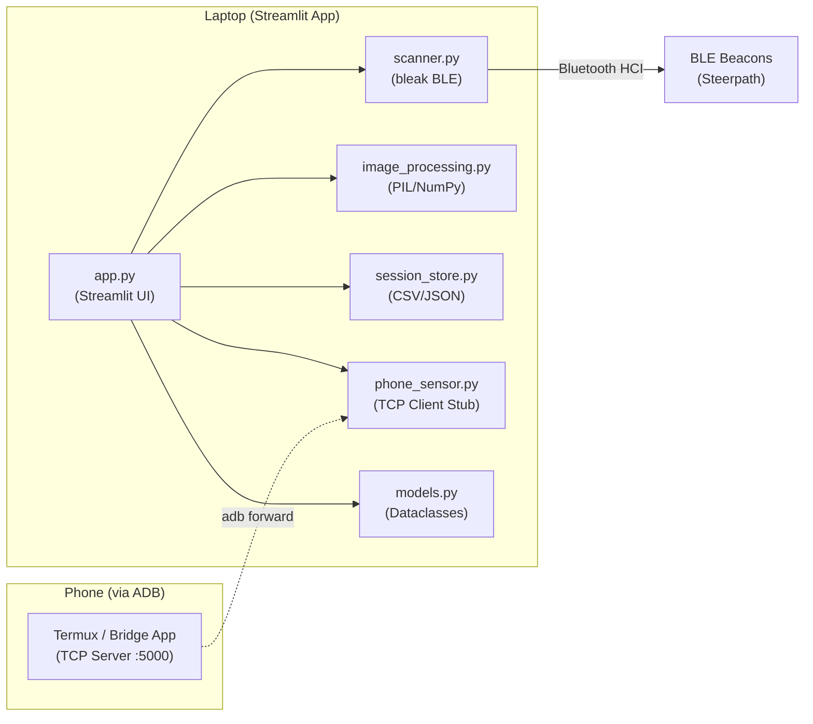

# Bluetooth Measurement Campaign Software

A Streamlit-based tool for measuring BLE signal strengths across a floor plan grid, designed for the Aalto University wireless systems course project.

## User Review Required

> [!IMPORTANT]
> **Streamlit + Canvas approach:** `streamlit-drawable-canvas` (v0.13.0) supports background images and returns click coordinates via `json_data`. However, it does **not** support keyboard events (arrow keys). Grid cell selection via arrow keys will be implemented using Streamlit's own `st.button` controls (◀▲▼▶ button pad) placed in the sidebar, alongside the click-to-select on the canvas.

> [!WARNING]
> **`streamlit-drawable-canvas` compatibility:** The original package (`v0.13.0`) may have compatibility issues with the latest Streamlit versions. If so, we'll use `streamlit-drawable-canvas-fix` as a drop-in replacement. I'll test this during setup.

## Open Questions

> [!IMPORTANT]
> 1. **Data export format:** Should measurements be saved as CSV, JSON, or both? I'm defaulting to **CSV** (easy for analysis in pandas/Excel) plus a **JSON** session dump for full fidelity.
> 2. **Phone sensor stub scope:** The Termux BLE research reveals that `termux-api` has **no native BLE scan command**. Real BLE scanning on Android requires a native Android app or bridge. The stub I'll create will define the TCP client protocol and include mock data for testing. Is that sufficient for now, or do you want me to scaffold the Android Kotlin app as well?

## Proposed Changes

### Project Structure

```
WS Measurement software/
├── venv/                          # Python virtual environment (gitignored)
├── .gitignore
├── requirements.txt
├── app.py                         # Streamlit entry point
├── scanner.py                     # BLE scanning (bleak)
├── phone_sensor.py                # TCP client stub for phone data
├── models.py                      # Data classes (GridCell, Measurement, ScanResult)
├── image_processing.py            # Floor plan color stripping, grid compositing
├── session_store.py               # Session data persistence (CSV/JSON export)
├── steerpath_research.md          # Research notes (already exists)
├── phone_setup_guide.md           # Instructions for phone BLE streaming
├── floor-plan-uc.jpg              # Sample floor plan (already exists)
└── floor-plan-uc-2.jpg            # Sample floor plan (already exists)
```

Follows the **small project** pattern from the python-patterns skill — flat structure, no unnecessary packages.

---

### Environment & Dependencies

#### [NEW] [requirements.txt](file:///home/cbot/Documents/WS%20Measurement%20software/requirements.txt)
```
streamlit>=1.38
streamlit-drawable-canvas>=0.13.0
bleak>=0.22
Pillow>=10.0
numpy>=1.26
pandas>=2.0
```

#### [NEW] [.gitignore](file:///home/cbot/Documents/WS%20Measurement%20software/.gitignore)
- `venv/`, `__pycache__/`, `*.pyc`, `.streamlit/`, uploaded images cache, etc.

---

### Data Models

#### [NEW] [models.py](file:///home/cbot/Documents/WS%20Measurement%20software/models.py)
- `@dataclass GridCell`: row, col coordinates.
- `@dataclass ScanResult`: mac_address, device_name, rssi_values (list), rssi_mean, rssi_median, rssi_variance, tx_power, metadata dict.
- `@dataclass Measurement`: timestamp, true_grid (GridCell), app_reported_grid (GridCell), scan_results (list[ScanResult]), scan_duration_seconds.
- Clean separation of data from logic (clean-code: classes do one thing).

---

### Image Processing

#### [NEW] [image_processing.py](file:///home/cbot/Documents/WS%20Measurement%20software/image_processing.py)
- `strip_color_range(image: Image, target_rgb: tuple, tolerance: int) -> Image`: Replaces pixels within a color range with transparent/white. Uses NumPy vectorized operations on the pixel array for performance.
- `composite_grid(image: Image, grid_spacing_px: int, color: str, opacity: float) -> Image`: Draws grid lines onto a copy of the image using PIL `ImageDraw`.
- `compute_grid_spacing_px(pixels_per_meter: float, cell_size_meters: float) -> int`: Converts physical cell size to pixel spacing.

Looking at the sample floor plans:
- [floor-plan-uc.jpg](file:///home/cbot/Documents/WS%20Measurement%20software/floor-plan-uc.jpg) has **red labels** (room type annotations) on a mostly white/grey/black architectural drawing.
- [floor-plan-uc-2.jpg](file:///home/cbot/Documents/WS%20Measurement%20software/floor-plan-uc-2.jpg) is cleaner — mostly black lines on white, with fewer red labels.
- The color stripping feature targets removing the **white/grey background fill** or the **red annotations**, leaving only structural edges.

---

### BLE Scanner

#### [NEW] [scanner.py](file:///home/cbot/Documents/WS%20Measurement%20software/scanner.py)
- `async scan_ble_devices(duration: float, mac_filter: list[str] | None) -> list[ScanResult]`:
  - Uses `bleak.BleakScanner` with a **detection callback** (`detection_callback` parameter) to capture every advertisement packet in real-time, bypassing OS-level RSSI caching.
  - Accumulates RSSI readings per MAC address over the scan window (3–5 seconds).
  - After the window closes, computes mean, median, and variance of RSSI per device.
  - Optionally filters to only specified MAC address prefixes (e.g., Steerpath beacon MACs).
- Clean single-responsibility: this module only scans, it doesn't store or display.

Key implementation detail — using the callback approach:
```python
from bleak import BleakScanner

rssi_accumulator: dict[str, list[int]] = {}

def on_advertisement(device, advertisement_data):
    rssi_accumulator.setdefault(device.address, []).append(advertisement_data.rssi)

scanner = BleakScanner(detection_callback=on_advertisement)
await scanner.start()
await asyncio.sleep(duration)
await scanner.stop()
```

---

### Phone Sensor Stub

#### [NEW] [phone_sensor.py](file:///home/cbot/Documents/WS%20Measurement%20software/phone_sensor.py)
- `class PhoneSensorClient`: A TCP socket client that connects to `127.0.0.1:5000` (bridged from phone via `adb forward tcp:5000 tcp:5000`).
  - `connect() -> bool`: Attempts connection, returns success/failure.
  - `read_packet() -> dict | None`: Reads one newline-delimited JSON packet from the stream.
  - `disconnect()`: Closes the socket.
  - Uses a `threading.Thread` internally to continuously read packets into a thread-safe queue.
- **Protocol:** Newline-delimited JSON. Each line is a JSON object with at minimum: `{"mac_address": str, "device_name": str, "rssi": int, "timestamp": float}`.
- Includes a `MockPhoneSensorServer` class for local testing that generates fake BLE data on port 5000.

#### [NEW] [phone_setup_guide.md](file:///home/cbot/Documents/WS%20Measurement%20software/phone_setup_guide.md)
Step-by-step instructions covering:
1. Installing Termux from F-Droid (NOT Play Store — Play Store versions are broken).
2. Installing `termux-api` and Python in Termux.
3. Android permissions (Location, Nearby Devices, Battery Unrestricted).
4. Running the mock TCP server script in Termux for testing.
5. `adb forward tcp:5000 tcp:5000` setup on the laptop.
6. Explanation that **real BLE scanning requires a native Android app** (Termux cannot access Android's BLE hardware APIs — no BlueZ/D-Bus on Android). The stub uses mock data or can receive from a bridge app.
7. Recommended lightweight BLE bridge apps from the Play Store as an alternative.

---

### Session Data Persistence

#### [NEW] [session_store.py](file:///home/cbot/Documents/WS%20Measurement%20software/session_store.py)
- `save_measurements_csv(measurements: list[Measurement], filepath: Path)`: Flattens measurements into a CSV with columns: `timestamp, true_row, true_col, app_row, app_col, mac_address, device_name, rssi_mean, rssi_median, rssi_variance, scan_duration`.
- `save_session_json(measurements: list[Measurement], metadata: dict, filepath: Path)`: Full JSON dump including grid config, image filename, and all raw RSSI arrays.
- `load_session_json(filepath: Path) -> tuple[dict, list[Measurement]]`: Reload a previous session.

---

### Streamlit App (Main UI)

#### [NEW] [app.py](file:///home/cbot/Documents/WS%20Measurement%20software/app.py)

**Layout:** `st.set_page_config(layout="wide")`

**Sidebar (`st.sidebar`):**
- **Floor Plan Upload**: `st.file_uploader` for `.jpg/.png` images.
- **Grid Configuration**:
  - `pixels_per_meter`: `st.slider` (10–200, default 50) — scales the grid to the image.
  - `cell_size_meters`: `st.select_slider` (0.25, 0.5, 1.0, 2.0) — physical size of each grid cell.
- **Image Processing**:
  - Color picker (`st.color_picker`) to select the target color to strip.
  - Tolerance slider (`st.slider`, 0–100).
  - "Apply" button to preview the stripped image.
- **MAC Filter**: `st.text_area` for entering MAC prefixes to filter (one per line), or empty for all devices.
- **Scan Duration**: `st.slider` (1–10 seconds, default 3).
- **App Reported Grid**: Two `st.number_input` fields (row, col) for manually entering the position the Aalto Space app reports.
- **Continuous Mode**:
  - `st.toggle` to enable/disable.
  - Direction picker: `st.selectbox` with N/S/E/W.
  - Interval: `st.slider` (1–30 seconds).

**Main Area:**
- **Canvas** (`st_canvas`):
  - Background image = uploaded floor plan (with grid lines composited via PIL).
  - Drawing mode = `"point"` or `"transform"` — we use the click coordinates from `json_data` to determine which grid cell was clicked.
  - Selected cell is highlighted (drawn as a filled semi-transparent rectangle on the composited background image).
- **Navigation Buttons**: A 3x3 button grid below the canvas: `[  ] [▲] [  ]` / `[◀] [●] [▶]` / `[  ] [▼] [  ]` for arrow-key-style movement.
- **Capture Button**: `st.button("📡 Capture Snapshot")` — triggers the BLE scan asynchronously (runs `asyncio.run()` in a background thread to avoid blocking Streamlit's event loop).
- **Measurement Table**: `st.dataframe` showing all captured measurements for the current session.
- **Export Buttons**: Download CSV / Download JSON.

**Canvas click → grid cell mapping:**
```python
if canvas_result.json_data and canvas_result.json_data["objects"]:
    last_click = canvas_result.json_data["objects"][-1]
    click_x, click_y = last_click["left"], last_click["top"]
    selected_col = int(click_x // grid_spacing_px)
    selected_row = int(click_y // grid_spacing_px)
```

**Continuous mode logic:**
- Uses `st.empty()` placeholder and a `while` loop with `time.sleep(interval)` inside `st.session_state` tracking.
- Each iteration: captures a snapshot, advances the selected cell in the chosen direction, and reruns.
- Stops when the cell would go out of bounds.

---

## Architecture Summary



## Verification Plan

### Automated Tests
- Not prioritized for this prototype. Manual verification is the focus.

### Manual Verification
1. **Setup**: Create venv, install dependencies, run `streamlit run app.py`.
2. **Image Upload**: Upload `floor-plan-uc.jpg`, verify it renders as canvas background.
3. **Grid Overlay**: Adjust `pixels_per_meter` and `cell_size_meters`, verify grid renders correctly over the floor plan.
4. **Color Stripping**: Pick the red color from the floor plan, apply stripping, verify red labels are removed.
5. **Cell Selection**: Click on canvas → verify correct grid cell is highlighted. Use navigation buttons → verify cell moves.
6. **BLE Scan**: Click "Capture Snapshot" → verify BLE devices are discovered with RSSI stats (requires Bluetooth hardware).
7. **Continuous Mode**: Enable, set direction East, interval 3s → verify it auto-advances and captures.
8. **Export**: Download CSV and JSON, verify data integrity.
9. **Phone Stub**: Run `MockPhoneSensorServer`, connect `PhoneSensorClient`, verify mock data flows through.
